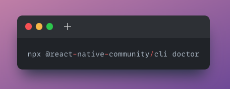
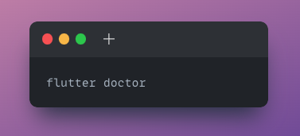
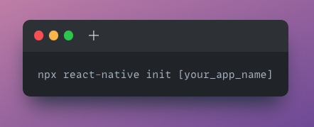
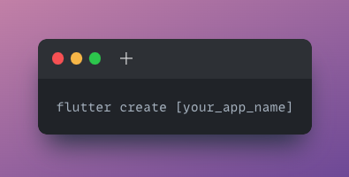
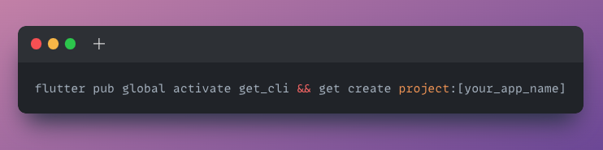
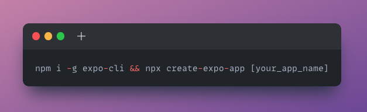

# A Beginner’s Guide to Building Mobile Apps with React Native and Flutter
Welcome to my blog on getting started with React Native and Flutter! These are two popular mobile development frameworks that allow you to build native apps for Android and iOS using a single codebase.

React Native is a JavaScript framework developed by Facebook that enables developers to build native apps using the popular React library. It uses the same design as React, letting you compose a rich mobile UI using declarative components.

Flutter, on the other hand, is a mobile development framework created by Google. It uses the Dart programming language and allows you to build visually attractive and high-performing apps for both Android and iOS.

In this blog, we’ll walk you through the process of setting up your development environment and creating your first program in both React Native and Flutter. We’ll also provide some tips and best practices to help you get started with these frameworks.

I hope you find this blog helpful as you begin your journey with React Native and Flutter.

## To run a React Native or Flutter app, you’ll need to meet the following requirements:

Install Android Studio or Xcode: Depending on the platform you want to build your app for, you’ll need to install either Android Studio (for Android) or Xcode (for iOS). These are both free and provide the tools you’ll need to build and run your app.
Set up an emulator: To run your app on a virtual device, you’ll need to set up an emulator. You can do this through either Android Studio or Xcode, depending on the platform you’re targeting.

## To run React Native check the following requirements:

Install Node.js: React Native requires Node.js to be installed on your machine. You can download it from the official website (https://nodejs.org/) and follow the instructions to install it.
Install the React Native CLI: The React Native CLI (Command Line Interface) is a tool that helps you create and run React Native projects. You can find detailed instructions on how to do this on the React Native website (https://reactnative.dev/docs/environment-setup).

## To run Flutter check the following requirements:

Install the Flutter SDK: To install Flutter, you’ll need to download the Flutter SDK and add it to your PATH. You can find detailed instructions on how to do this on the Flutter website (https://flutter.dev/docs/get-started/install).

## Validate your installation for React Native:

## Validate your installation for Flutter:

## Creating App in React Native:

## Creating App in Flutter:

In addition to using the React Native and Flutter SDKs, it’s also possible to build mobile apps using Getx and Expo.

Getx is a state management and dependency injection library for Flutter that aims to make it easier to build scalable and maintainable Flutter apps. It provides a set of tools and patterns that can help you manage the state of your app and reduce the complexity of your codebase.

## Creating App in Flutter using Getx using get_cli:

Expo is a platform for building mobile apps with React Native that offers a set of tools, libraries, and services that make it easier to get started with React Native. It provides a framework for building native apps, as well as a development environment and toolchain that simplifies the process of creating, testing, and deploying apps.

## Creating App in React Native using Expo:

While both React Native and Flutter provide their own set of tools and libraries for building mobile apps, using Getx or Expo can provide additional benefits and make it easier to get started with these frameworks. If you’re interested in using either of these tools, be sure to check out their respective documentation for more information. Getx:(https://pub.dev/packages/get), get_cli: (https://pub.dev/packages/get_cli) Expo: (https://docs.expo.dev/)

## Conclusion:

In this blog, we’ve covered the basics of getting started with React Native and Flutter, including how to set up your development environment and create your first program. We’ve also highlighted some of the additional tools and resources that can make it easier to work with these frameworks, such as Getx and Expo.